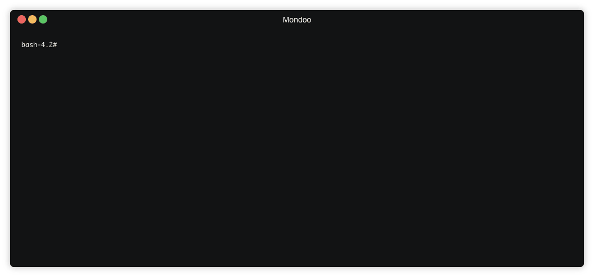

# Binary Installation

> Note: Binary installation is mostly suited for workstation and CI/CD installation. For server installations, we recommend our package-based installation since it allows upgrades of the Mondoo agent via operating system package managers  



Mondoo distributes binaries for all supported platform and architectures. To install agent, download the [appropriate package](https://releases.mondoo.io/mondoo/). Archives for unix systems are packaged as `.tar.gz`, for Windows systems we use `.zip`. After the download is complete, extract the content. The Mondoo agent is a single binary named `mondoo`. The last step is to add the `mondoo` binary to the path.

## Script

For Linux and macOS, we provide a bash script that does the following:

* detect the operating system
* downloads the mondoo binary for your operating system

```
curl -sSL https://mondoo.io/download.sh | bash
```

Once installed you can register the agent:

```
MONDOO_REGISTRATION_TOKEN="ey..iU"
mondoo register --token $MONDOO_REGISTRATION_TOKEN
```

> Note: we encourage you to familiarize yourself with our script before you use it.
> The source is available in our public [github repository](https://github.com/mondoolabs/mondoo/blob/master/download.sh)

## Manual

**Unix/Linux**

To add the binary to the shell search path, add `export PATH="$PATH:/path/to/dir"` to your `~/.profile` or `~/.bashrc` file. 

**Windows**

On Windows, you can configure the path via the control panel:

1. Go to `Control Panel` -> `System` -> `System settings` -> `Environment Variables`
2. In section `System variables` scroll down until you find `Path`.
3. Click edit and add the new path, make sure you split paths vis semicolon i.e. `C:\path1;C:\path2`
5. Launch a new console to take changes in effects


