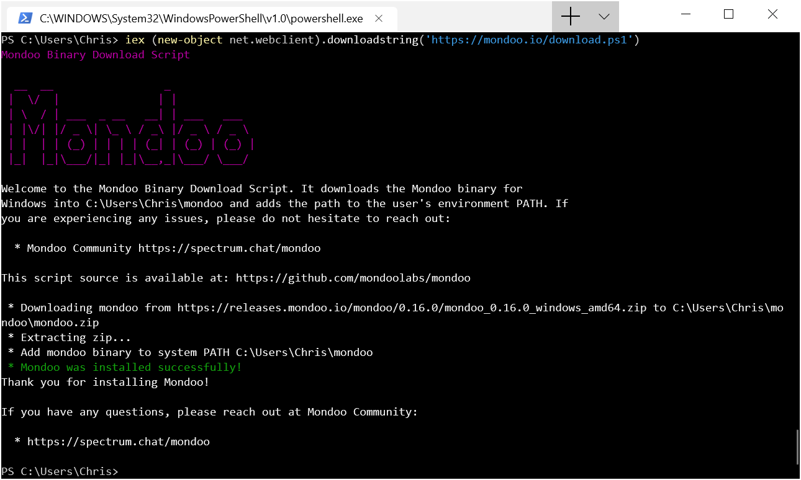

# Installing Mondoo Agent on Windows

## Powershell

Run this powershell script to install Mondoo to its default location in `C:\Users\<user>\mondoo`.

```
iex (new-object net.webclient).downloadstring('https://mondoo.io/download.ps1')
```



Once the agent is installed, you can register the agent
```
$TOKEN="pastetokenhere"                                               mondoo register --token $TOKEN                                         ✔  agent //agents.api.mondoo.app/spaces/peaceful-burnell-555533/agents/1ON7UPoNpkKxkMncKTFUcwZLVrt registered successfully
```

## Binary Download

Mondoo distributes binaries for Windows. To install agent, download the [appropriate package](https://releases.mondoo.io/mondoo/). Archives for Windows systems use `.zip`. After the download is complete, extract the content. The Mondoo agent is a single binary named `mondoo`. The last step is to add the `mondoo` binary to the path. You can configure the path via the control panel:

1. Go to `Control Panel` -> `System` -> `System settings` -> `Environment Variables`
2. In section `System variables` scroll down until you find `Path`.
3. Click edit and add the new path, make sure you split paths vis semicolon i.e. `C:\path1;C:\path2`
5. Launch a new console to take changes in effects


## WSL: Windows Subsystem for Linux

If you are using the WSL, you can use our [Bash installer for Linux](./bash):

```
MONDOO_REGISTRATION_TOKEN='ey...ax'
curl -sSL https://mondoo.io/install.sh | bash
```


