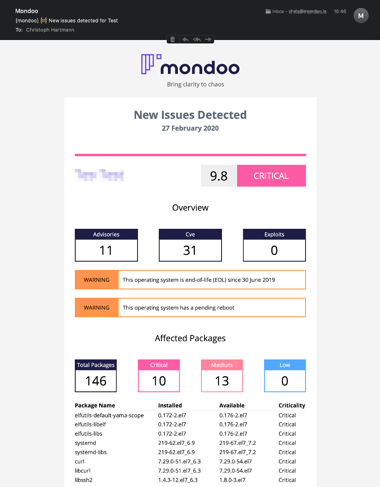

# Email Alerts

Email alerts are the default notification mechanism. You can opt-in into:

* Newsletter subscriptions
* Email notifications

When you enable email notification you recieve a new report, when the risk level of an asset has changed

