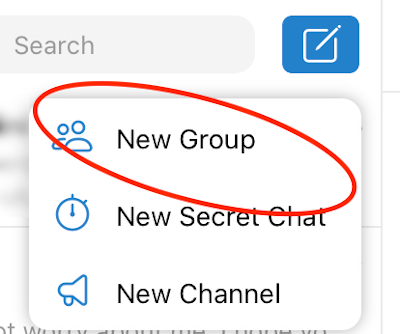
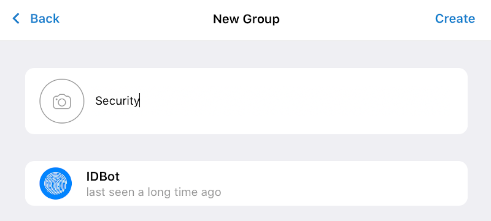

# Telegram

[Telegram](https://telegram.org/) is a secure messaging app. Mondoo can be configured to send alert messages to Telegran. To set the integration up, you will need to generate a Telegram bot token and determine the Chat ID.


## Configuration

- `token` - Telegram bot token. You can obtain a new ot token by contacting [@BotFather](https://telegram.me/botfather)
- `chat-id` - Recipient Group Channel. You can obtain the chat-id by contacting [@myidbot](https://telegram.me/myidbot)


## Setup

To configure Mondoo with Telegram, the following is needed:

* a Telegram bot and its access token
* a Telegram chat ID

### Create a Telegram Bot

Open Telegram and search for the [@BotFather](https://telegram.me/botfather) username. Then start a new conversation with @BotFather with `/newbot` and `@BotFather` will respond:


During the conversation he will tell you the Telegram access token:

```
Use this token to access the HTTP API:
<telegram-access-token>
```

### Get your Telegram chat ID

Create a new chat group in telegram



Invite the [@myidbot](https://telegram.me/myidbot)


Enter a chat group name



Ask the myidbot `/getgroupid@myidbot` and it will return the chat id. Then, disinvite the `@myidbot`


### Configure Mondoo

Open Mondoo Dashboard and switch to your space that you want to configure. Then select Settings -> Integrations and configure Telegram access token and chat id. Then, Save


Enable the Telegram integration


