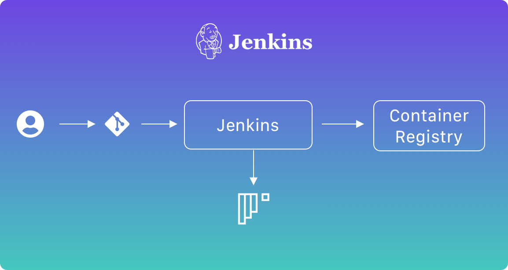
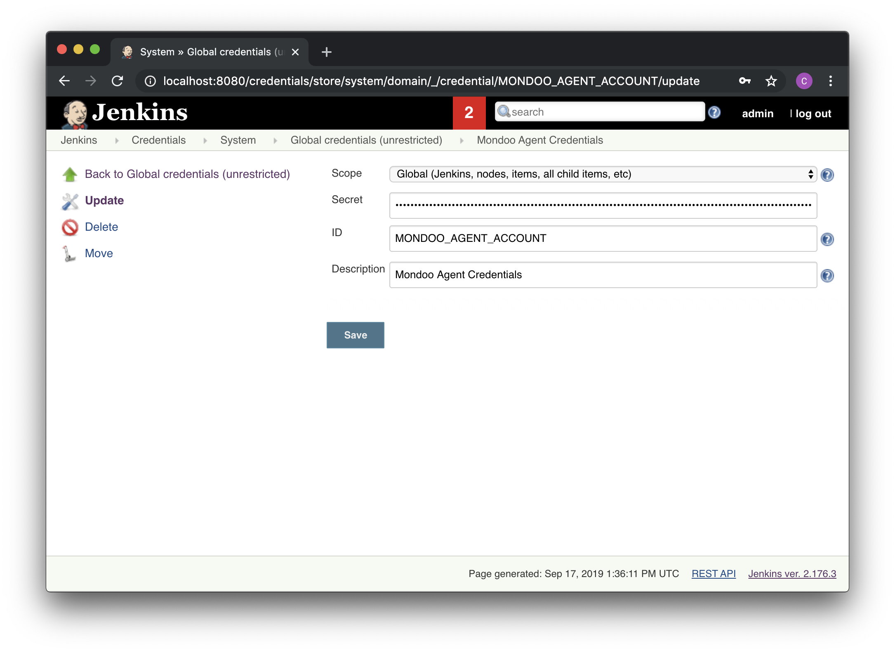

## Jenkins



Mondoo works great in [Open Source Jenkins](https://jenkins.io/) and [Cloudbees Jenkins Distribution](https://www.cloudbees.com/products/cloudbees-jenkins-distribution). It is straight-forward to integrate Mondoo into [Jenkins Pipeline](https://jenkins.io/doc/book/pipeline/):

```
pipeline {
  environment {
    REGISTRY = "jenkins-docker-example"
  }
  agent any
  stages {
    stage('Cloning Git') {
      steps {
        git 'https://github.com/mondoolabs/mondoo.git'
      }
    }
    stage('Building image') {
      steps{
        script {
          dockerImage = docker.build("${REGISTRY}:${env.BUILD_ID}")
        }
      }
    }
    stage('Scan image') {
      environment {
        MONDOO_AGENT_ACCOUNT = credentials('MONDOO_AGENT_ACCOUNT')
      }
      steps{
        sh "echo ${MONDOO_AGENT_ACCOUNT} | base64 -d > mondoo.json"
        sh 'curl -sSL https://mondoo.io/download.sh | bash'
        sh './mondoo version'
        sh "./mondoo scan -t docker://${REGISTRY}:${env.BUILD_ID} --config mondoo.json"
      }
    }
    stage('Deploy Image') {
      // For a Docker Registry which requires authentication,
      // add a "Username/Password" Credentials item from the Jenkins home page and use the
      // Credentials ID as a second argument to withRegistry():
      environment {
        REGISTRY_CREDS = credentials('REGISTRY_CREDS')
      }
      steps{
        script {
          docker.withRegistry( '', REGISTRY_CREDS ) {
            dockerImage.push()
          }
        }
      }
    }
    stage('Remove Unused docker image') {
      steps{
        sh "docker rmi ${REGISTRY}:${env.BUILD_ID}"
      }
    }
  }
}

```

The Mondoo agent requires a secret to authenticate. Generate the base64-encoded secret in Mondoo Dashboard and store it as a [Jenkins Credentials](https://jenkins.io/doc/book/using/using-credentials/) `MONDOO_AGENT_ACCOUNT`. You can either [download the credentials](../../agent/installation/registration) or use the CI/CD integration page. For Jenkins we recommend to encode the [credentials as base64](#store-mondoo-credentials).



You can see the vulnerability report as part of the CI/CD job.

