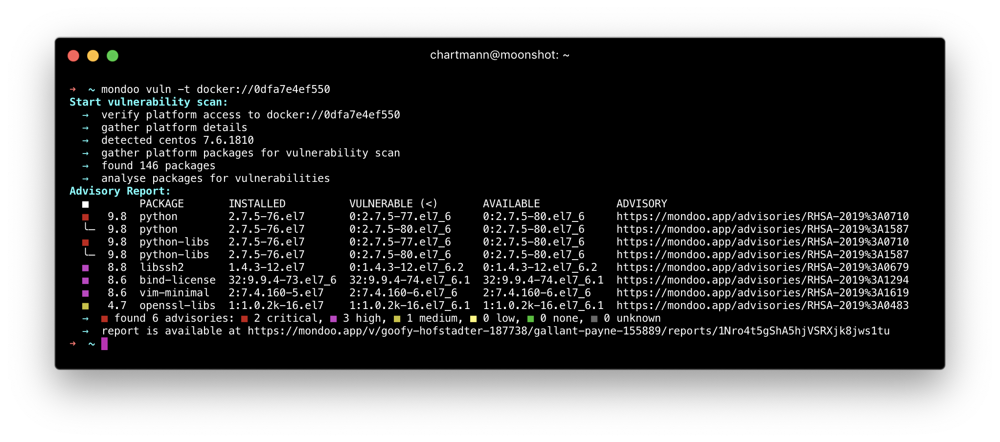
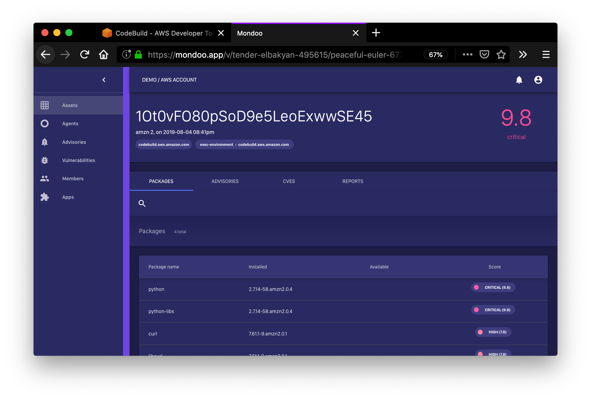

# Getting Stated

Mondoo is designed to help you identify risk across your fleet. It [integrates very well](../integration.md) in your infrastructure. Out-of-the-box Mondoo ships with integration for major cloud environments, CI/CD environments and build tools like [Packer](../devops/packer.md) as well as provisioning tools like [Terraform](../devops/terraform.md), [Ansible](../installation/ansible.md) and [Chef](../installation/chef.md).

Mondoo support vulnerability scanning for the following environments:

*Server*

- [SSH Targets](./server.md#ssh-targets)
- [Ansible Inventory](./server.md#ansible-inventory)
- [Local System](./server.md#local-system)

*Cloud Workloads*

- [Azure Compute Instances](./cloud-workload.md#azure-instances)
- [AWS EC2 Instances](./cloud-workload.md#aws-ec2-instances)
- [GCP Compute Instances](./cloud-workload.md#gcp-instances)

*Container & Kubernetes*

- [Kubernetes](./container.md#kubernetes)
- [Docker Images](./container.md#docker-images)
- [Docker Container](./container.md#docker-container)

*Container Registry*

- [Azure Container Registry](./registry.md#azure-container-registry)
- [AWS Elastic Container Registry](./registry.md#aws-elastic-container-registry)
- [Docker Hub Repository](./registry.md#aws-elastic-container-registry)
- [Google Cloud Container Registry](./registry.md#google-cloud-container-registry)
- [Harbor Registry](./registry.md#harbor-registry)

Vulnerablity Scans are supported for the following operating systems:

- Amazon Linux 1, 2
- CentOS 6, 7, 8
- Debian 8, 9, 10
- openSUSE
- Oracle Linux 6, 7, 8
- RedHat 6, 7, 8
- Suse 12, 15
- Ubuntu 14.04, 16.04, 18.04, 20.04
- Windows Server 2016, 2019

Mondoo reports can be viewed on terminal:

In your Mondoo dashboard:

Or in your CI/CD environment:

While the Mondoo agent is designed to run continuously on your server infrastructure, it is also easy to use CLI for quick ad-hoc vulnerability scans. This allows anybody to gather a quick risk assessment for a specific asset.

The following examples assume you have [installed Mondoo on your workstation](../installation).

