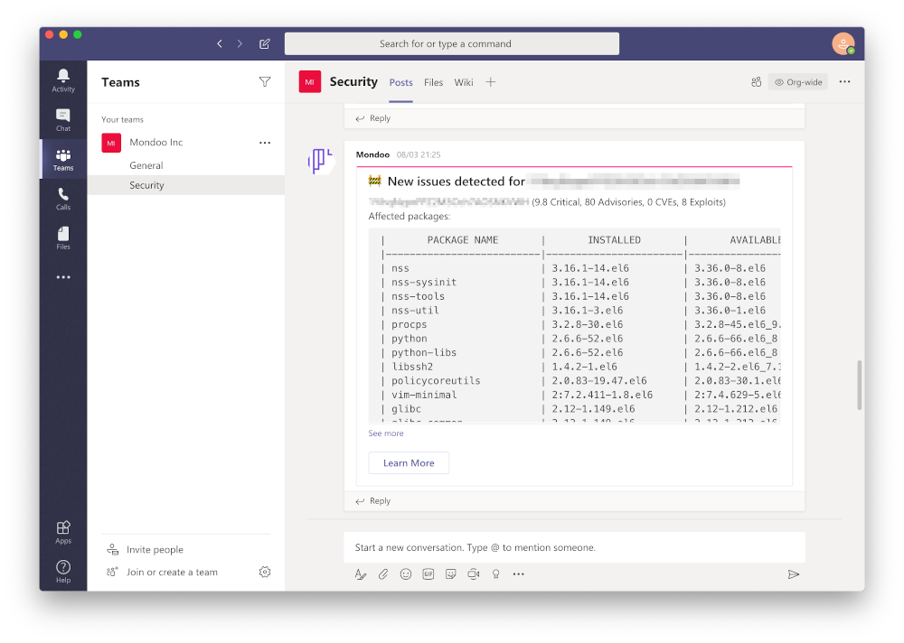
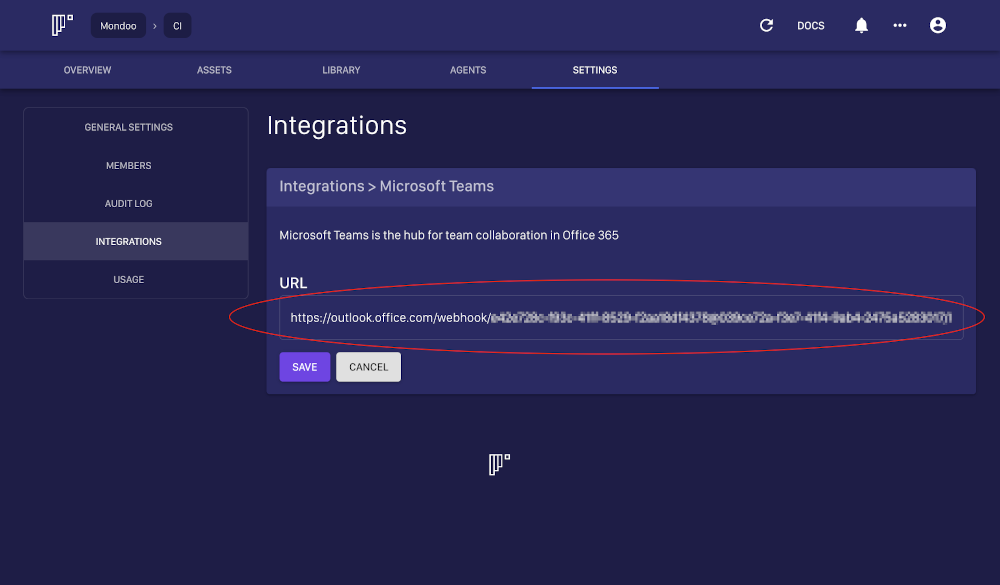

# Microsoft Teams

[Microsoft Teams](https://teams.microsoft.com/start) is a widely used communication tool. Mondoo can be configured to send alert messages to Microsoft Teams. To set the integration up, you will need to generate a new Microsoft Teams Webhook URL.

## Configuration

- `url` - the Micosoft Teams Webhook URL. This URL can be obtained by adding a new `Connection` for your channel

## Setup

1. Open the Microsoft Teams app, select a team and a channel within that team
2. Click the `ellipsis icon` on the right side of the selected channel
3. Click `Connectors`

4. Search the Incoming Webhook connector and click `Add` or `Configure`

5. Provide a webhook name and an icon. Complete by clicking `Create`

6. Click on the `Copy` icon next to the generated webhook URL to use it in Mondoo

7. Open Mondoo Dashboard and switch to your space that you want to configure. Then select Settings -> Integrations and configure Microsoft Teams Webhook URL and Save

8. Enable the Microsoft Teams integration

