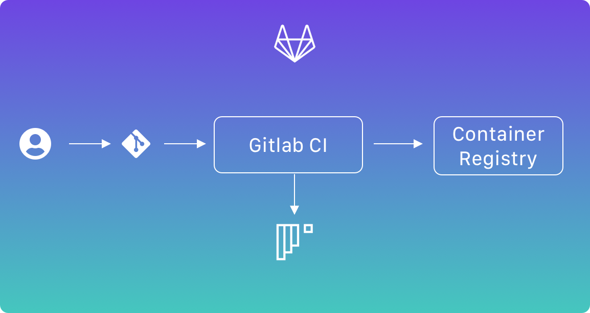
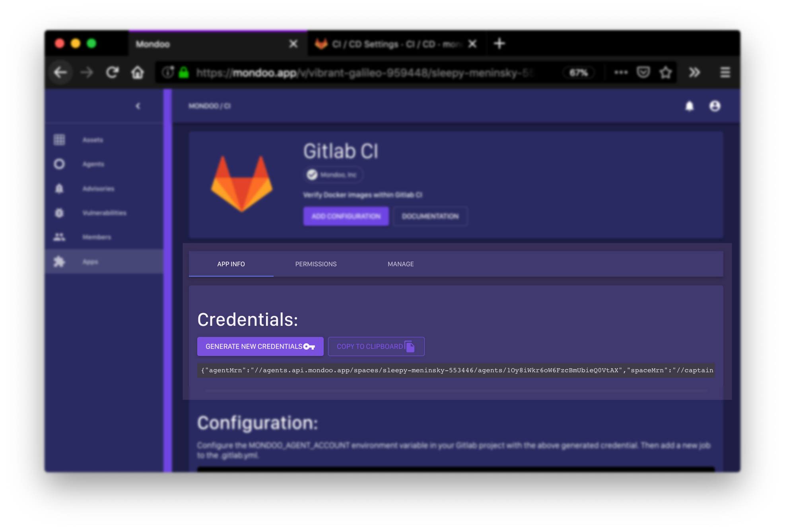
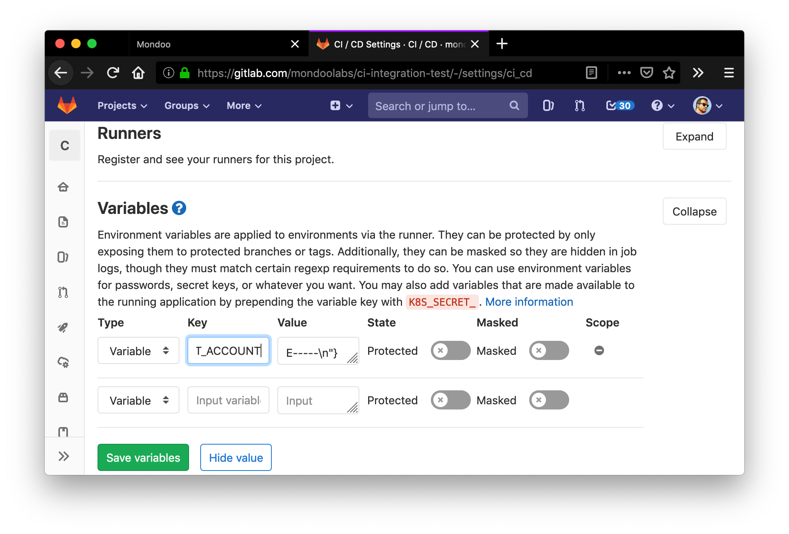
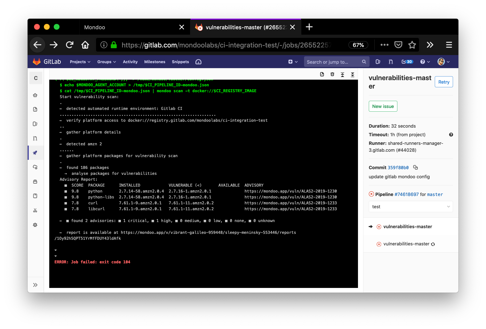
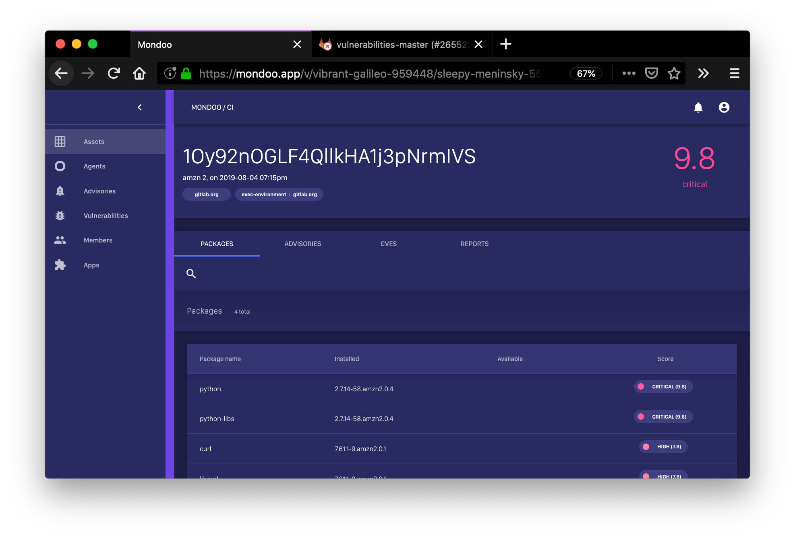

## Gitlab



Since Gitlab makes heavy use of Docker containers as a runtime environment, it is the easiest to use Mondoo's docker image. It is very easy to add a vulnerability job in your `.gitlab-ci.yml`:

```yaml
# Build docker image
build-master:
  image: docker:latest
  stage: build
  services:
    - docker:dind
  before_script:
    - docker login -u "$CI_REGISTRY_USER" -p "$CI_REGISTRY_PASSWORD" $CI_REGISTRY
  script:
    - docker build --pull -t "$CI_REGISTRY_IMAGE" .
    - docker push "$CI_REGISTRY_IMAGE"

  only:
    - master

# Scan docker image
vulnerabilities-master:
  stage: test
  image:
    name: mondoolabs/mondoo:latest
    entrypoint: [""]
  script:
    - mkdir -p /root/.docker/ && echo "{\"auths\":{\"$CI_REGISTRY\":{\"username\":\"$CI_REGISTRY_USER\",\"password\":\"$CI_REGISTRY_PASSWORD\"}}}" > /root/.docker/config.json
    - echo $MONDOO_AGENT_ACCOUNT > /tmp/$CI_PIPELINE_ID-mondoo.json
    - mondoo scan -t docker://$CI_REGISTRY_IMAGE --config /tmp/$CI_PIPELINE_ID-mondoo.json
  # allow_failure: true
  only:
    - master
  dependencies:
    - build-master
```

Additionally, you need to configure your Gitlab project to store the credentials for the Mondoo agent in `MONDOO_AGENT_ACCOUNT`. You can either [download the credentials](../agent/configuration) or use the Gitlab integration page. Just select Sidebar -> Apps -> Gitlab and generate new credentials:
 


Next, you create a new `MONDOO_AGENT_ACCOUNT` variable and paste the content of the agent credentials:



You can see the vulnerability report as part of the CI/CD job.



Also, it is easy to see the result in your Mondoo dashboard:

