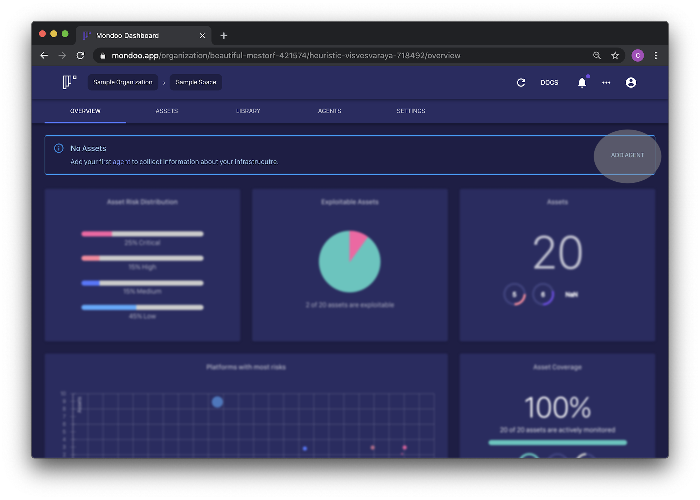

# Quickstart

The easiest way to try Mondoo is by installing the agent locally on your workstation or use our  Docker container `mondoolabs/mondoo`. You can easily try out

* [Sign Up](#sign-up)
* [Install Mondoo CLI](#install-mondoo-cli)
* [Do your first scan](#first-scan)

## Sign Up

Go to [Mondoo Dashboard](https://mondoo.app) and register for a new account


Once registered, you see the welcome screen


Then create a new organization and space


## Install Mondoo CLI

To quickly assess the state of a your systems, install the Mondoo CLI on your workstation.

**macOS Workstation**


```
brew tap mondoolabs/mondoo
brew install mondoo
```

See [Installing Mondoo Agent on macOS workstation](../installation/macos.md) for further information.

**Linux Workstation**

```
curl -sSL https://mondoo.io/download.sh | bash
```

> Note: We support a wide range of [Linux operating systems](../installation) . We recommend our [package installation](../installation/bash.md#installing-mondoo-agent-via-bash-script) for server environments to ensure you always retrieve the latest updates. For workstations, we also provide a [script that just ships with the mondoo binary](../installation/binaries.md).

**Windows workstation**


```powershell
iex (new-object net.webclient).downloadstring('https://mondoo.io/download.ps1')
```
See [Installing Mondoo Agent on Windows workstation](../installation/windows.md) for further information.

### Create CLI credentials



The Mondoo CLI use a secure private key to sign the communication with an individual key. Via a registration token, the agent is able to retrieve its credentials securely.

Use the [dashboard](../installation/registration.md#agent-registration) to gather a new registration token.


```
mondoo register --token 'ey...FlP'
  ✔  agent //agents.api.mondoo.app/spaces/dazzling-hermann-857694/agents/1NmZG4Mt2fKXRrYGvUPiyLG7JyQ registered successfully
```

## First scan

Scan a SSH target:

```
mondoo scan -t ssh://ec2-user@54.205.49.51
Start vulnerability scan:
  →  verify platform access to ssh://ec2-user@54.205.49.51
  →  gather platform details
  →  detected amzn 2
  →  gather platform packages for vulnerability scan
  →  found 435 packages
  →  analyse packages for vulnerabilities
Advisory Report:
  ■   SCORE  PACKAGE       INSTALLED               VULNERABLE (<)          AVAILABLE               ADVISORY
  ■   7.8    curl          7.61.1-9.amzn2.0.1      7.61.1-11.amzn2.0.2     7.61.1-11.amzn2.0.2     https://mondoo.app/vuln/ALAS2-2019-1233
  ■   7.8    libcurl       7.61.1-9.amzn2.0.1      7.61.1-11.amzn2.0.2     7.61.1-11.amzn2.0.2     https://mondoo.app/vuln/ALAS2-2019-1233
  ■   6.9    kernel        4.14.123-111.109.amzn2  4.14.133-113.112.amzn2  4.14.133-113.112.amzn2  https://mondoo.app/vuln/ALAS2-2019-1253
  ╰─  6.5    kernel        4.14.123-111.109.amzn2  4.14.133-113.105.amzn2  4.14.133-113.112.amzn2  https://mondoo.app/vuln/ALAS2-2019-1232
  ■   6.9    kernel-tools  4.14.133-113.105.amzn2  4.14.133-113.112.amzn2  4.14.133-113.112.amzn2  https://mondoo.app/vuln/ALAS2-2019-1253
  →  ■ found 3 advisories: ■ 0 critical, ■ 1 high, ■ 2 medium, ■ 0 low, ■ 0 none, ■ 0 unknown
  →  report is available at https://mondoo.app/v/tender-elbakyan-495615/gallant-kilby-587371/reports/1P4JUZrB1n6rkKU5J5JthPtP42Q
  ```

Scan a Docker image:

```
mondoo scan -t docker://ubuntu:18.04
Start the vulnerability scan:
  →  verify platform access to docker://ubuntu:18.04
  →  gather platform details
  →  detected ubuntu 18.04
  →  gather platform packages for vulnerability scan
  →  found 89 packages
  →  analyze packages for vulnerabilities
Advisory Report:
  ■   SCORE  PACKAGE      INSTALLED            VULNERABLE (<)         AVAILABLE  ADVISORY
  ■   8.1    libzstd1     1.3.3+dfsg-2ubuntu1  1.3.3+dfsg-2ubuntu1.1             https://mondoo.app/vuln/USN-4108-1
  ■   5.5    libsystemd0  237-3ubuntu10.25     237-3ubuntu10.29                  https://mondoo.app/vuln/USN-4120-2
  ■   5.5    libudev1     237-3ubuntu10.25     237-3ubuntu10.29                  https://mondoo.app/vuln/USN-4120-2
  →  ■ found 2 advisories: ■ 0 critical, ■ 1 high, ■ 1 medium, ■ 0 low, ■ 0 informational, ■ 0 unknown
  →  The report is available at https://mondoo.app/v/tender-elbakyan-495615/gallant-kilby-587371/reports/1R165jpyvo23TDNc2HygM0E9KSA

```